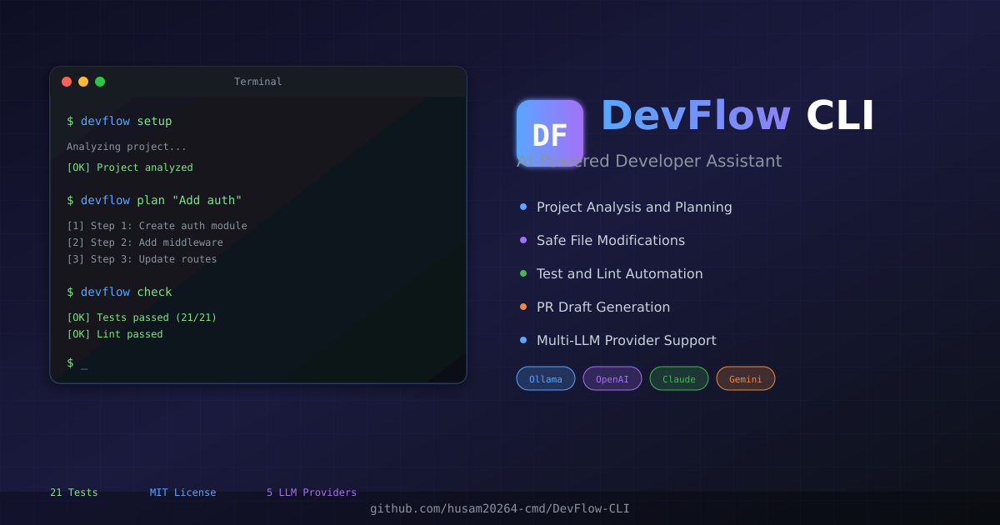
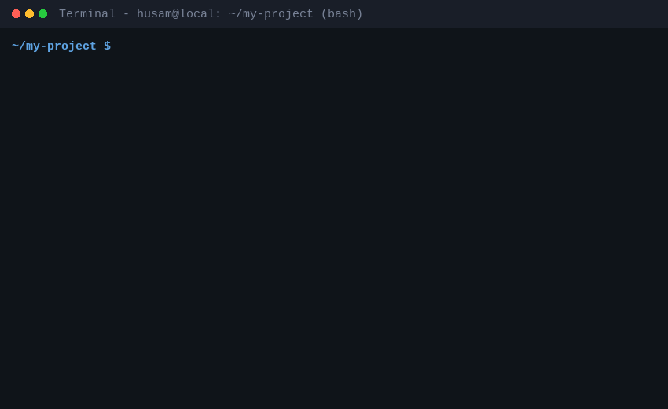

<p align="center">
  
</p>

<p align="center">
  <a href="https://github.com/husam20264-cmd/DevFlow-CLI/blob/main/LICENSE">
    
  </a>
  <a href="https://github.com/husam20264-cmd/DevFlow-CLI/releases">
    
  </a>
  <a href="https://github.com/husam20264-cmd/DevFlow-CLI">
    
  </a>
  <a href="https://github.com/husam20264-cmd/DevFlow-CLI">
    
  </a>
</p>

# DevFlow CLI

A privacy-aware AI assistant for software projects, built for developers who want structured implementation plans, safer code changes, and automated project checks from the terminal.

## Getting Started in 60 Seconds

1. Install:
   ```bash
   git clone https://github.com/husam20264-cmd/DevFlow-CLI.git
   cd DevFlow-CLI
   npm install -g .
   ```

2. Set up your API key:
   ```bash
   export OPENAI_API_KEY=your_key_here
   # or use any of the 5 supported providers
   ```

3. Get your first implementation plan:
   ```bash
   devflow plan "Add user authentication"
   ```

4. Review changes and apply with `--apply` when ready

## Features

- **Project Analysis** — Understands repository structure, language, and configuration before making recommendations
- **Implementation Plans** — Generates step-by-step plans from natural-language requests
- **Safe File Changes** — Dry-run preview by default; changes only applied with `--apply`
- **Error Explanation** — Analyzes errors and suggests specific fixes
- **Test & Lint Runner** — Executes project checks and reports results
- **PR Draft Generation** — Creates pull-request descriptions with change summaries
- **Multi-Provider LLM** — Switchable providers for flexibility and privacy

## Free LLM Providers (Open Source)

All basic LLM integrations are **free and open source**:

| Provider | Mode | Default Model | Cost |
|----------|------|---------------|------|
| Ollama | Local (offline) | codellama:7b | Free |
| OpenAI | Cloud | gpt-4o | Pay-per-use |
| Anthropic | Cloud | claude-sonnet-4-20250514 | Pay-per-use |
| Gemini | Cloud | gemini-2.0-flash | Free tier available |
| llama.cpp | Local (offline) | Custom model | Free |

## Enterprise Features (Paid)

Need custom integration for your company? [Contact us](https://github.com/husam20264-cmd/DevFlow-CLI/issues)

| Feature | Description |
|---------|-------------|
| **Custom Model Integration** | Connect your internal models |
| **Azure OpenAI** | Use your Azure subscription |
| **AWS Bedrock** | Enterprise AWS integration |
| **Vertex AI** | Google Cloud enterprise |
| **On-Premise Deployment** | Docker/Kubernetes deployment |
| **SSO & Team Permissions** | SAML, OIDC, role-based access |
| **Audit Logs** | Track all AI interactions |
| **Security Policies** | Custom data handling rules |
| **GitHub/GitLab/Jira/Slack** | Native integrations |

### Enterprise Pricing

| Tier | Price | What's Included |
|------|-------|-----------------|
| **Custom Provider** | $300–$800 | Connect your internal model |
| **Small Business Setup** | $1,000–$2,500 | Full configuration + training |
| **Monthly Support** | $200–$1,000/mo | Maintenance + updates |

> **We don't sell "add Claude"** — We sell "connect DevFlow to your company's environment, models, and policies."

## Quick Start

Get started in 3 simple commands:

```bash
# 1. Install globally
npm install -g devflow-cli

# 2. Set up your API key (choose your provider)
export OPENAI_API_KEY=your_key_here
# or use Anthropic, Gemini, Ollama, etc.

# 3. Get your first implementation plan
devflow plan "Add user authentication"
```



## Commands

### Setup

```bash
devflow setup
```

Analyzes the current project and displays language, file count, and configuration.

### Plan

```bash
devflow plan "Add JWT authentication"
```

Generates a step-by-step implementation plan. Default mode is **dry-run** — shows what would change without writing files.

```bash
devflow plan "Add user roles" --apply
```

Use `--apply` to execute the plan.

### Explain

```bash
devflow explain error.log
cat error.log | devflow explain
```

Analyzes error output and provides explanation, root cause, and fix suggestions.

### Check

```bash
devflow check
```

Runs tests and lint checks using the project's configured scripts.

### PR

```bash
devflow pr -d "Add authentication system"
```

Generates a PR draft with title, description, file changes, and checklist.

## Safety Model

DevFlow is designed to be **review-first**:

- **Dry-run by default** — Plans are shown before any file is modified
- **Sensitive file protection** — Modifications to `.env`, credentials, and keys require confirmation
- **Path traversal prevention** — Cannot access files outside the project directory
- **Hardcoded secret detection** — Warns when code contains potential API keys or passwords
- **Dangerous command blocking** — `rm -rf`, `sudo`, `git push --force` require explicit approval
- **Backup system** — Creates backups before modifying existing files

## Configuration

DevFlow stores configuration in `~/.devflow/config.json`:

```json
{
  "activeProvider": "ollama",
  "providers": {
    "openai": { "apiKey": "env:OPENAI_API_KEY" }
  }
}
```

## Project Structure

```
devflow-cli/
├── bin/devflow.js              # CLI entry point
├── src/
│   ├── core/
│   │   ├── engine.js           # Main orchestration engine
│   │   ├── project-analyzer.js # Repository structure analysis
│   │   ├── file-changer.js     # Safe file modifications with backup
│   │   ├── safety-guard.js     # Command and file protection
│   │   ├── test-runner.js      # Test and lint execution
│   │   └── pr-generator.js     # Pull-request draft generation
│   ├── providers/
│   │   └── llm-manager.js      # Multi-provider LLM system
│   └── commands/
│       └── index.js            # CLI command implementations
├── tests/
│   └── cli.test.js             # Test suite (21 tests)
└── package.json
```

## Testing

```bash
npm test
```

Run the full test suite covering project analysis, safety guards, file changes, PR generation, and engine initialization.

## Use Cases

- **Feature Planning** — Convert requirements into structured implementation steps
- **Repository Onboarding** — Understand unfamiliar codebases quickly
- **Code Review Prep** — Generate PR descriptions and check summaries
- **Error Debugging** — Get explanations and fix suggestions for cryptic errors
- **Team Workflows** — Standardize how changes are planned and documented

## License

MIT — Free for personal and commercial use.

---

**Enterprise inquiries:** [Open an issue](https://github.com/husam20264-cmd/DevFlow-CLI/issues) or contact us directly.
